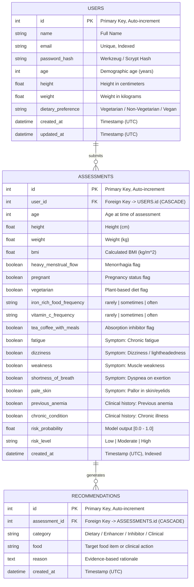

# Database Entity-Relationship (ER) Diagram

## Overview
The **IronHer AI** database schema follows a normalized relational structure enforcing 1-to-Many cascade relationships:
`User (1) ───< Assessment (N) ───< Recommendation (N)`

## Relational Integrity & Schema Guarantees
1. **User Isolation**: Every assessment has a mandatory `user_id` foreign key with cascade deletion. Query scopes are strictly filtered by `user_id = session["user_id"]`.
2. **Audit Preservation**: Assessments are append-only. When a user updates their profile, existing historical assessments remain intact with the biometric values recorded at screening time.
3. **Database Portability**: The schema uses standard ANSI types compatible with SQLite for local development and PostgreSQL (e.g., Render, AWS RDS, Supabase) for cloud production.
