# System Architecture

## Architectural Blueprint

The **IronHer AI** platform is designed using a clean, layered multi-tier architecture ensuring complete separation of concerns between presentation, routing, persistence, statistical inference, and expert heuristic evaluation.

```mermaid
flowchart TD
    subgraph Client_Layer ["Client Layer (Browser)"]
        User(["👤 Female User / Patient"])
        UI_Home["Landing & Nutrition Guide (HTML5/CSS3)"]
        UI_Auth["Auth Forms (Login / Register)"]
        UI_Form["Screening Assessment Questionnaire"]
        UI_Dashboard["Dynamic Dashboard (Chart.js Trends)"]
        UI_Result["Result Page & Actionable Plan"]
        UI_Chatbot["Top-Right Floating AI Nutrition Copilot\n(chat.js)"]
    end

    subgraph Presentation_Layer ["Presentation & Routing Layer (Flask 3.x)"]
        Router["Flask Routing & Request Controller\n(app.py)"]
        AuthMiddleware["Session Auth & Ownership Guard\n(@login_required)"]
        ErrorHandler["Custom Error Handlers\n(404, 403, 500)"]
    end

    subgraph Service_Layer ["Core Processing & Engine Layer"]
        BMI["BMI Engine\n(kg / m²)"]
        ML_Pipeline["Scikit-Learn Pipeline\n(StandardScaler + OneHot + RandomForest)"]
        Rec_Engine["Personalized Nutrition Recommender\n(recommender.py)"]
        Factors_Engine["Explainability & Factor Attribution\n(Considered Factors Engine)"]
        AI_Chatbot["AI Nutrition Chat Engine\n(ai_chat.py + Medical Guardrails)"]
    end

    subgraph Storage_Layer ["Data Persistence Layer"]
        DB_Interface["Data Access Layer\n(database.py)"]
        SQLAlchemy["Flask-SQLAlchemy ORM 3.1"]
        Database[("SQLite / PostgreSQL\nusers, assessments, recommendations")]
    end

    %% User Interactions
    User -->|Visits / Enters Data| UI_Home
    User -->|Registers / Signs In| UI_Auth
    User -->|Submits Questionnaire| UI_Form
    User -->|Monitors Longitudinal Health| UI_Dashboard
    User -->|Asks Questions to Copilot| UI_Chatbot

    %% Client to Server Flow
    UI_Auth -->|POST /login, /register| Router
    UI_Form -->|POST /assessment| AuthMiddleware
    UI_Chatbot -->|POST /api/chat| Router
    AuthMiddleware -->|Authenticated Request| Router
    Router -->|Authorization Failure| ErrorHandler

    %% Router to Services Flow
    Router -->|1. Raw Height & Weight| BMI
    Router -->|2. Ingest Feature Vector| ML_Pipeline
    ML_Pipeline -->|3. Risk Probability & Tier| Router
    Router -->|4. Assessment State + Risk| Rec_Engine
    Rec_Engine -->|5. Food-First Recommendations| Router
    Router -->|6. Transparent Factor Breakdown| Factors_Engine

    %% Persistence Flow
    Router -->|7. Persist Assessment & Recs| DB_Interface
    DB_Interface --> SQLAlchemy
    SQLAlchemy --> Database

    %% Response Flow
    Router -->|8. Render Isolated Result| UI_Result
    Database -->|Query Historical Records| DB_Interface
    DB_Interface -->|Fetch Aggregates & Trends| Router
    Router -->|JSON /api/user/trends| UI_Dashboard
```

## Architectural Design Highlights
1. **No Inlined Database Queries in Routes**:
   All database queries, inserts, and aggregation computations reside exclusively in `database.py`. Routes are kept thin, testable, and maintainable.
2. **Unified Preprocessing & Estimator Pipeline**:
   The `anemia_model.joblib` artifact encapsulates both the `ColumnTransformer` (standardizing numeric metrics and one-hot encoding food frequencies) and the trained `RandomForestClassifier`. This prevents training-serving skew.
3. **Food-First Rule Engine**:
   `recommender.py` parses vegetarian lifestyle choices, menstrual loss, pregnancy status, and symptom presence to construct evidence-based dietary recommendations, strictly preventing supplement dosages or medications.
4. **Per-User Isolation**:
   Before rendering any assessment result or history, the controller checks whether `assessment.user_id == session["user_id"]`. Unauthorized access triggers an immediate `403 Forbidden` response.
